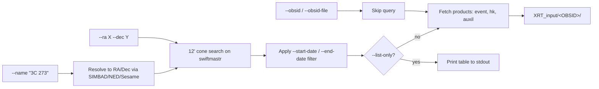

# Step 2 — Download data

Fetch raw Swift XRT observations from the HEASARC archive with
`swift_xrt_download.py`, organized into the per-OBSID directory tree the rest of
the pipeline expects. You point it at a source — by name, by coordinates, or by
an explicit OBSID list — optionally narrow to a date window, and it pulls the
event files, housekeeping, and auxiliary products that [Step 3 —
xrtpipeline](03-xrtpipeline.md) needs. This is the first step that produces data
on disk.

## What runs

`swift_xrt_download.py` has two modes:

- **Listing mode** (`--list-only`): resolves a source name or coordinates to a
  12′ cone search on HEASARC's `swiftmastr` (Swift Master Catalog), applies any
  date filter, and prints a table of matching observations to stdout. Nothing is
  downloaded. Use it to preview before committing to a download.
- **Download mode**: runs the same query and then actually fetches the products
  into `--outdir`. Alternatively, with `--obsid` or `--obsid-file` the catalog
  query is skipped entirely and the named OBSID(s) are pulled directly.

Key flags shipped post-`1.2.2.fix`:

| Flag | Purpose |
| ---- | ------- |
| `--name` / `-n` | Source name to resolve (e.g. `"3C 273"`), then 12′ cone search |
| `--ra` / `--dec` | Query at an explicit J2000 position (decimal degrees) |
| `--obsid` | Download a single observation by ID (skips the catalog query) |
| `--obsid-file` | Read OBSIDs from a file, one per line (skips the catalog query) |
| `--start-date` | Keep observations on or after this date (UTC, **inclusive**) |
| `--end-date` | Keep observations strictly before this date (UTC, **exclusive**) |
| `--outdir` / `-o` | Output directory (default `./swift_xrt_data`) |
| `--radius` / `-r` | Cone-search radius in arcminutes (default 12) |
| `--mode` | Filter event files by XRT mode: `pc`, `wt`, `im` (default: all) |
| `--products` | Product subdirs to fetch (default: `xrt/event xrt/hk auxil`) |
| `--clean-only` | Skip unfiltered `_uf` event files; keep only cleaned/screened |
| `--list-only` / `-l` | Print the matching-observation table without downloading |
| `--max-obs` / `-m` | Cap the number of observations downloaded |
| `--test N` / `-t N` | Test mode: download only the first N observations |
| `--overwrite` | Re-download files even if they already exist at the right size |

`--name`, `--ra`/`--dec`, `--obsid`, and `--obsid-file` are mutually exclusive —
pick one input path.

## How it works

The three input paths converge on a single cone-search + filter pipeline (or,
for explicit OBSIDs, bypass the catalog entirely):



Name resolution tries SIMBAD, NED, CDS Sesame, and astroquery in sequence
(astroquery is optional — the chain falls back gracefully without it). Archive
URL discovery learns the optimal strategy (HEASARC date-based path vs. UKSSDC
flat mirror) after the first successful download and reuses it for the rest,
and interrupted downloads resume by skipping files already present at the
correct size.

**MJD float detail.** `swiftmastr` stores each observation's `start_time` as an
MJD float (e.g. `56725.7111`), not a calendar date. The `--start-date` /
`--end-date` filter handles that conversion internally (MJD 40587 = the Unix
epoch, 1970-01-01) — you always pass plain `YYYY-MM-DD` calendar dates and the
script does the comparison in MJD space. `--start-date` is inclusive;
`--end-date` is an exclusive upper bound.

**Cone-search caveat.** The query returns *all* Swift pointings within the
radius (12′ by default), not just the named target. For a crowded field this
means you get nearby sources too — see [Gotchas](#gotchas). There is no
`--target-name` filter by design; narrow with a date window instead, or accept
the extra pointings as off-axis fill (the off-axis angle surfaces at
[Step 4 — survey](04-survey.md) so the master tables can flag them).

## Inputs and outputs

**Inputs** (one input path, plus an optional date window):
- a source name (`--name`), **or**
- explicit coordinates (`--ra` / `--dec`), **or**
- an explicit OBSID list (`--obsid` or `--obsid-file`),
- optionally `--start-date` / `--end-date` to restrict the time range.

**Outputs:** a per-OBSID directory tree under `--outdir`. With the default
`--products`, each OBSID gets three subdirectories:

```
XRT_input/
└── <OBSID>/                       e.g. 00035017029
    ├── xrt/
    │   ├── event/                 cleaned + unfiltered event files, exposure images
    │   │   ├── sw<OBSID>xwtw2po_cl.evt.gz      (cleaned level-2)
    │   │   ├── sw<OBSID>xwtw2po_uf.evt.gz      (unfiltered; skip with --clean-only)
    │   │   └── sw<OBSID>xwtw2po_ex.img.gz      (exposure map)
    │   └── hk/                    XRT housekeeping (sw<OBSID>x*.hk, bias images)
    └── auxil/                     spacecraft-level auxiliary products
```

The `auxil/` payload is downloaded **in full** — do not try to slim it.
`xrtpipeline`'s `prefilter` step reads several of these files, so pruning the
directory breaks every OBSID. The payload per OBSID includes:

| File | What it is |
| ---- | ---------- |
| `sw<OBSID>sat.fits.gz` | attitude (spacecraft pointing) file |
| `sw<OBSID>sen.hk.gz` | spacecraft housekeeping — **required by prefilter** |
| `SWIFT_TLE_ARCHIVE.txt.*.gz` | orbit / two-line-element archive — **required by prefilter** |
| `sw<OBSID>pat.fits.gz` | attitude products |
| `sw<OBSID>sao.fits.gz` | spacecraft orbit/attitude |
| `sw<OBSID>sti.fits.gz` | star-tracker info |
| `sw<OBSID>uat.fits.gz` | uncorrected attitude |
| `sw<OBSID>s.mkf.gz` | filter / make-filter file (used for screening) |
| `sw<OBSID>p*.par.gz`, `sw<OBSID>pob.cat.gz` | processing parameter / catalog files |

(An earlier default of `xrt/auxil` 404'd because `auxil/` actually lives at the
OBSID top level, not under `xrt/` — that was fixed in `1.2.2.fix`.)

## Common variants

```bash
# By source name + date window (most common)
swift_xrt_download.py --name "3C 273" --start-date 2008-08-04 --end-date 2011-07-06 --outdir XRT_input

# By coordinates (no name resolution)
swift_xrt_download.py --ra 187.2779 --dec 2.0524 --outdir XRT_input

# By explicit OBSID list
swift_xrt_download.py --obsid-file my_obsids.txt --outdir XRT_input

# Preview without downloading
swift_xrt_download.py --name "3C 273" --list-only --start-date 2008-08-04 --end-date 2011-07-06
```

An OBSID file is plain text, one ID per line; blank lines and `#` comments
(including inline) are ignored:

```
# epoch-1 pointings
00035017001
00035017002    # inline comments OK
00050900011
```

## Gotchas

1. **The cone search returns nearby sources too.** When you `--name "3C 273"`,
   you get *all* Swift pointings within 12′ — which for 3C 273 includes 27
   pointings of the nearby AGN SDSS J122933+015810. For most use cases you
   either filter on observation date or accept the additional pointings as
   off-axis fill (the off-axis angle column appears in
   [Step 4 — survey](04-survey.md), so the master tables can flag them). There
   is no `--target-name` filter, **by design** — Swift target-name strings
   aren't canonical enough to be reliable.

   ```mermaid
   flowchart TD
     N["--name &quot;3C 273&quot; → 12' cone"] --> A["3C 273 pointings (on-target)"]
     N --> B["SDSS J122933+015810 (27 pointings, ~off-axis)"]
     A --> S["Step 4 survey: off-axis angle per OBSID"]
     B --> S
     S --> M["You decide include/exclude in the master tables"]
   ```

2. **`$CALDB` and CIAO.** Sourcing CIAO repoints `$CALDB` at its Chandra tree,
   which doesn't contain the Swift XRT responses. This doesn't affect the
   download itself, but it bites the fit step — cross-reference:
   see [Step 1 — Setup](01-setup.md#gotchas).

3. **MJD vs ISO dates.** Internal time on `swiftmastr` is an MJD float. The
   date filter does the MJD↔calendar conversion for you — always pass
   `YYYY-MM-DD`. Remember `--end-date` is exclusive (strictly before), while
   `--start-date` is inclusive.

## Notes

<!-- Eileen: drop observations here as you walk through. Format suggestion:
     - 2026-MM-DD — observation / gotcha / "I ran this on X and Y happened"
-->

_(no notes yet)_
