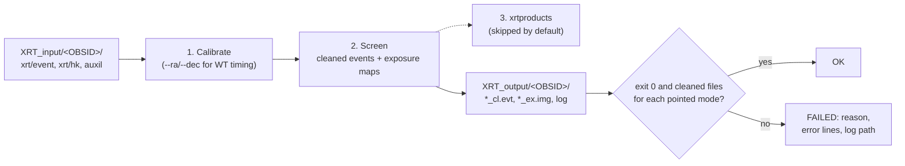

# Step 3 — Run xrtpipeline

`xrt_pipeline.py` runs HEASoft's `xrtpipeline` on every observation you
downloaded in [Step 2](02-download.md). For each OBSID it recalibrates and
screens the raw events with the current calibration database (CALDB), then
writes a cleaned level-2 event file and an exposure map for each XRT mode.
Every later step reads these files from the output folder.

Run it in the **HEASoft terminal** (`setup_swiftxrt; heainit`, never `ciao`).
In a CIAO terminal it stops before doing anything. See
[Step 1 — Two terminals](01-setup.md#two-terminals).

## What runs

`xrtpipeline` is HEASoft's standard Swift XRT reduction task. One call
processes a whole OBSID: both modes (PC and WT) and every segment, meaning the
pointed observation plus any settling and slew segments. It works in three
stages:

1. **Calibrate.** Process the XRT housekeeping, flag hot and bad pixels,
   compute event grades and energies, and convert positions to sky
   coordinates. In WT mode the CCD records position along one axis only, so
   xrtpipeline uses your source position to compute each photon's arrival
   time.
2. **Screen.** Keep events inside good-time intervals built from the
   housekeeping, attitude and orbit data (the `auxil/` files from Step 2), and
   keep the standard event grades (PC 0–12, WT 0–2). This writes the cleaned
   event files (`*_cl.evt`), then an exposure map for each (`*_ex.img`).
3. **Products.** Extract spectra and light curves with `xrtproducts`. The
   wrapper **skips this** by default. Nothing downstream reads these products,
   [Step 7](07-extract.md) makes its own spectra, and this stage hung on one
   OBSID in the May test run.

`xrt_pipeline.py` wraps each call so a whole batch runs unattended:

- **Batch mode.** With `--batch` it finds every OBSID folder (a name of 8–11
  digits) under `--indir` and writes each one to `<outdir>/<OBSID>/`, running
  `--nproc` of them at once.
- **A private parameter folder per run.** HEASoft tools keep their settings in
  parameter files under `~/pfiles`, and CIAO writes there too. A stale file
  left there by CIAO broke xrtpipeline on amorgos. Each run gets a fresh
  folder instead, which also keeps parallel runs from colliding.
- **A terminal per run.** Some HEASoft tools abort when there is no terminal.
  Each run gets its own pseudo-terminal, so batches also work under `nohup`,
  `cron`, or after an SSH session drops.
- **A time limit per OBSID** (`--timeout`, default 600 s). A stuck run is
  killed along with everything it started, marked FAILED, and the batch moves
  on.
- **A product check.** An OBSID counts as OK only if xrtpipeline exited 0
  *and* left a cleaned event file and exposure map for each mode with pointed
  data in the input.
- **Logs and exit status.** Each OBSID's full xrtpipeline output goes to
  `<outdir>/<OBSID>/xrtpipeline_<OBSID>.log`. Failures print the error lines
  from it. The script exits 0 only if every OBSID succeeded.

| Flag | Purpose |
| ---- | ------- |
| `--indir` | One OBSID folder, or with `--batch` the folder that holds them (e.g. `XRT_input`) |
| `--outdir` | Output folder for that OBSID, or with `--batch` the parent (each OBSID goes to `<outdir>/<OBSID>/`) |
| `--ra` / `--dec` | Source position, J2000 decimal degrees (required) |
| `--batch` | Process every OBSID folder under `--indir` |
| `--nproc` | Number of OBSIDs to run at once (default 1) |
| `--timeout` | Per-OBSID time limit in seconds (default 600) |
| `--createexpomap` | Make exposure maps, `yes`/`no` (default `yes`; Step 7 needs them) |
| `--extractproducts` | Run stage 3 (`xrtproducts`), `yes`/`no` (default `no`) |
| `--cleanup` | Let xrtpipeline delete its temporary files, `yes`/`no` (default `no`) |
| `--clobber` | Overwrite existing output, `yes`/`no` (default `yes`) |

The grade selections (PC 0–12, WT 0–2) are fixed in the wrapper.

## How it works



**Why re-run it at all?** The archive's `xrt/event/` folders already contain
cleaned `*_cl.evt.gz` files. They were made with whatever software and
calibration were current when each observation was processed, and with the
archive's choice of source position. Re-running processes every observation
the same way, with today's CALDB and your position. Later steps read only the
re-processed files.

A batch prints one line per OBSID as it finishes, then a summary. Here is a
batch of five epoch-1 OBSIDs. `00035017030` was copied without its `auxil/`
folder to show what a failure looks like:

```
$ xrt_pipeline.py --batch --nproc 4 --indir XRT_input --outdir XRT_output --ra 187.2779 --dec 2.0524

Found 5 ObsID directories to process.
Running in parallel with 4 workers.
  All 5 workers submitted. Waiting for results...

  [1/5] 00035017030: FAILED (14s) -- exit code 1
  [2/5] 00035017029: OK (25s)
  [3/5] 00035017018: OK (27s)
  [4/5] 00035017037: OK (30s)
  [5/5] 00035017073: OK (65s)

============================================================
  BATCH SUMMARY  (5 observations, 79s total)
============================================================
  SUCCESS : 4
            00035017018  (27s)
            00035017029  (25s)
            00035017037  (30s)
            00035017073  (65s)
  FAILED  : 1
    FAILED: 00035017030 (exit code 1)
            | ................. : ERROR attitude file not found
            | xrtpipeline_0.13.7 Attitude File not found
            log: /opt/swift-xrt-pipeline/test_runs/doc3/XRT_output/00035017030/xrtpipeline_00035017030.log
============================================================
```

The exit status here is 1, because one OBSID failed.

**Timing on amorgos.** A typical WT observation takes 25–30 s, a 6 ks PC
observation about a minute, and epoch 1's longest (17 ks of PC) about 3
minutes. All 86 epoch-1 OBSIDs take about 4.5 minutes with `--nproc 16`.
amorgos has 48 cores and is shared, so 16 is plenty.

## Inputs and outputs

**Inputs:**
- the OBSID folders from Step 2, each with `xrt/event/`, `xrt/hk/` and the
  complete `auxil/`. xrtpipeline stops without the attitude file, the
  spacecraft housekeeping (`sen.hk`) or the orbit file;
- your source position (`--ra`, `--dec`);
- a HEASoft terminal, with `$HEADAS` and `$CALDB` pointing at HEASoft and its
  Swift CALDB.

**Outputs:** one flat folder per OBSID under `--outdir`. For an observation
with both modes:

```
XRT_output/
└── 00035017018/
    ├── sw00035017018xpcw3po_cl.evt     cleaned PC events, pointed     ← Steps 4, 5, 7
    ├── sw00035017018xpcw3po_ex.img     PC exposure map                ← Step 7
    ├── sw00035017018xwtw2po_cl.evt     cleaned WT events, pointed     ← Steps 4, 6, 7
    ├── sw00035017018xwtw2po_ex.img     WT exposure map                ← Step 7
    ├── *_uf.evt, *_ufre.evt            calibrated events before screening
    ├── *_clgti.fits, *_ufbp.fits, *_ufhp.fits
    │                                   good-time intervals, bad and hot pixels
    ├── *_rawinstr.img.gz, *_skyinstr.img.gz, *_sumskyinstr.img.gz
    │                                   instrument maps behind the exposure maps
    ├── sw00035017018s.mkf, *.attorb    filter file and attitude/orbit file
    ├── sw00035017018xhdtc.hk           corrected XRT housekeeping
    ├── *.xco, SWIFT_TLE_ARCHIVE.txt.*  scripts and copies used during the run
    └── xrtpipeline_00035017018.log     xrtpipeline's full output
```

File names follow `sw<OBSID>x<mode>w<window><segment>`: mode `pc` or `wt`,
window `w1`–`w4`, segment `po` (pointed), `st` (settling) or `sl` (slew).
The master tables in Steps 5 and 6 list only pointed files, so the spectra
come from pointed data; the Step 4 survey also lists the settling and slew
segments. In 3C 273 epoch 1, 84 OBSIDs have pointed WT data, 6 have pointed
PC data, and about 60 also have WT settling and slew segments.

Each OBSID folder takes 8–15 MB for the short observations above and 34 MB
for the 6 ks PC observation (073).

Every later step runs from inside the output folder:

```bash
cd XRT_output
```

## Common variants

```bash
# All OBSIDs, 16 at a time (the usual way)
xrt_pipeline.py --batch --nproc 16 --indir XRT_input --outdir XRT_output \
    --ra 187.2779 --dec 2.0524

# Redo one OBSID, e.g. one that failed in the batch
xrt_pipeline.py --indir XRT_input/00035017030 --outdir XRT_output/00035017030 \
    --ra 187.2779 --dec 2.0524

# A long batch that keeps running after you log out
nohup xrt_pipeline.py --batch --nproc 16 --indir XRT_input --outdir XRT_output \
    --ra 187.2779 --dec 2.0524 > xrtpipeline_batch.log 2>&1 &

# Very long exposures (17 ks took ~3 min): allow more time per OBSID
xrt_pipeline.py --batch --nproc 16 --timeout 1800 --indir XRT_input \
    --outdir XRT_output --ra 187.2779 --dec 2.0524
```

A single OBSID prints the exact `xrtpipeline` command, then the products it
found:

```
  [SUCCESS] 00035017073 (62s)
  [FOUND]   cleaned_pc_evt       sw00035017073xpcw3po_cl.evt
  [FOUND]   exposure_map_pc      sw00035017073xpcw3po_ex.img
```

## Gotchas

1. **HEASoft terminal only.** In a CIAO terminal the script stops at once:

   ```
   ERROR: this step needs a HEASoft environment without CIAO.
     - CIAO is set up in this terminal, and CIAO's python has replaced $HEADAS with /opt/ciao/ciao-4.16/spectral, so the HEASoft tools this step runs cannot find their files.
     ...
   ```

   Running `heainit` in the same terminal does not undo `ciao`. Open a new
   terminal and run `setup_swiftxrt; heainit`.

2. **Give your target's position.** WT arrival times depend on `--ra`/`--dec`.
   Use the same position you give Steps 5–7. If you downloaded with `--name`,
   Step 2 printed it (`[info] SIMBAD resolved to RA=…, Dec=…`).

3. **A failed OBSID doesn't stop the batch.** Read the summary: each failure
   shows its reason, the last two error lines, and the log path. Until you fix
   and re-run it, that OBSID is missing from every later step. The usual cause
   is an incomplete `auxil/` folder (`Attitude File not found` above), so
   download that OBSID again with [Step 2](02-download.md). The end of each
   log has a "SWIFT XRT pipeline Report" listing what was created.

4. **Re-running starts over.** There is no resume. A second batch reprocesses
   every OBSID and overwrites its output. To redo one OBSID, use the
   single-OBSID form above. If you re-run this step after the later steps,
   re-run those too.

5. **Keep the exposure maps.** `--createexpomap no` saves about a third of the
   time, but Step 7 needs the maps to make each spectrum's ARF. Without them,
   extraction fails for every observation.

6. **Leave `--extractproducts` at `no`.** The stage-3 products aren't used
   downstream, and this stage hung on OBSID 037 in May. The time limit would
   now stop such a hang, but there is no reason to run it.

7. **Files appear in the input folders.** xrtpipeline runs inside each input
   OBSID folder, so `xselect.log` and `xsel_timefile.asc` appear there. They
   are harmless.

8. **Running `xrtpipeline` yourself.** The wrapper handles two problems you
   meet when running the HEASoft task directly. `couldn't get parameter
   'leapname'` (`PIL_BAD_FILE_ACCESS`) means a stale parameter file in
   `~/pfiles`; give it a fresh parameter folder with
   `export PFILES="$(mktemp -d);$HEADAS/syspfiles"`. Without a terminal (cron,
   `nohup`) it dies with `Unable to redirect prompts to the /dev/tty`; run it
   under `script -qec '<command>' /dev/null`.

## Notes

<!-- Eileen: drop observations here as you walk through. Format suggestion:
     - 2026-MM-DD — observation / gotcha / "I ran this on X and Y happened"
-->

_(no notes yet)_
