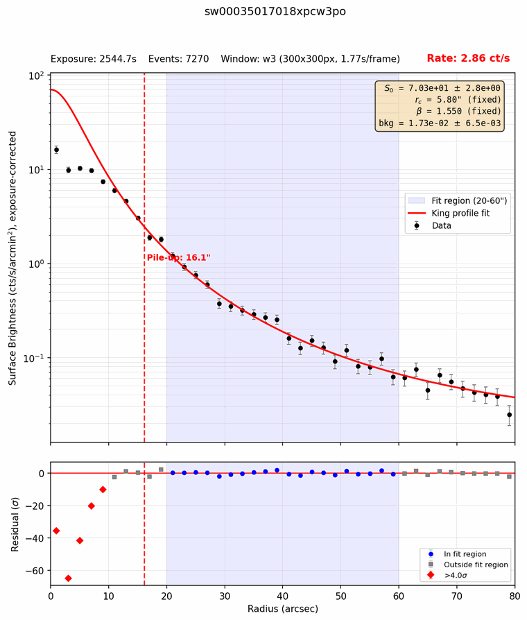
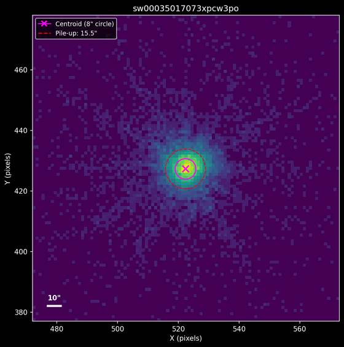

# Step 5 — PC-mode inspection

In PC (photon counting) mode the XRT images the whole field, reading the CCD
out every 1.77 s (in the `w3` window used for 3C 273). When a source is
bright, two or more photons often land on the same few pixels within one
frame. The CCD then records them as a single event with their summed energy,
or rejects it. This is **pile-up**: it removes counts from the core of the
source and hardens its spectrum, so the core has to be excluded from the
spectrum.

This step has three parts:

- **5a** `swift_xrt_king_profile.py` measures, for every PC observation, how
  much of the core to exclude (the pile-up radius).
- **5b** `swift_pc_source_viewer.py` draws a zoomed image of each source so
  you can check it by eye.
- **5c** a shell command makes the PC master table, which decides what
  [Step 7](07-extract.md) extracts.

Run them from inside `XRT_output`, in either terminal. They take seconds.

## What runs

### 5a — Pile-up radius

For each PC cleaned event file in each OBSID folder, the script:

1. **Finds the source.** It starts at `--ra`/`--dec` and moves to the mean
   position of the events within 15″, repeating with a shrinking circle.
2. **Builds a radial profile**: surface brightness in 2″ rings out to 80″, in
   ct/s/arcmin². Each ring is divided by its *exposed* area, from the Step 3
   exposure map, so bad columns crossing the source don't take counts out of
   some rings.
3. **Fits the PSF to the wings.** The King model of the XRT point-spread
   function, S(r) = S0 (1 + (r/rc)²)^−β + bkg, is fit between 20″ and 60″,
   where pile-up doesn't reach. The shape is fixed at the Swift calibration
   values (rc = 5.8″, β = 1.55); only the normalization S0 and the background
   are free.
4. **Sets the pile-up radius.** Pile-up depends on how many photons land on
   the same pixels in one frame. So the radius is where the fitted profile,
   which pile-up doesn't touch because it was fit to the wings, falls below
   4.5 counts per frame per arcmin². S0 is taken at the top of its 1σ range, so
   a short, noisy exposure errs toward a larger radius. If the radius reaches
   into the 20–60″ fit range, those wings are piled up too, and the script
   refits further out. [How the radius is chosen](#how-the-radius-is-chosen)
   shows how the threshold was tested.
5. **Flags rings that differ from the model**, by 4σ or by 3σ in two
   neighbouring rings. The flags appear in the plot and in `_pileup.txt` as a
   diagnostic only; they don't set the radius.
6. **Applies overrides.** A radius you set in `pileup_overrides.txt` (in the
   working folder) replaces the automatic one.

| Flag | Purpose |
| ---- | ------- |
| `--ra` / `--dec` | Source position, J2000 decimal degrees (required) |
| `--rmin` / `--rmax` | Radii of the wing fit, in arcsec (default 20 and 60) |
| `--rbin` | Ring width in arcsec (default 2) |
| `--maxplot` | Largest radius plotted (default `--rmax` + 20) |
| `--centroid` | Search radius for the source position, in arcsec (default 15) |
| `--rc` / `--beta` | PSF shape, fixed (default 5.8″ and 1.55) |
| `--sbthresh` | Pile-up threshold in counts/frame/arcmin² (default 4.5) |
| `--sigma` / `--sigma2` | Thresholds for the diagnostic ring flags: two neighbouring rings / one ring (default 3 and 4) |
| `--pdf` | Name of the collected plots (default `king_profiles.pdf`) |

### 5b — Source images

For each PC file with a `_pileup.txt`, the viewer draws a 100-pixel (about
4′) square around the source, with the source position (magenta, 8″ circle),
the pile-up radius (red dashed) and any override (purple dashed).

| Flag | Purpose |
| ---- | ------- |
| `--dimension` | Image size, e.g. `100px` (default) or `120arcsec` |
| `--radius` | Radius of the magenta circle, in arcsec (default 8) |
| `--pdf` | Name of the collected images (default `source_images.pdf`) |
| `--sosta` | Also mark `xrtcentroid` positions read from `source_extraction_<OBSID>.txt` files. Nothing in this pipeline writes those files |

### 5c — PC master table

A shell command (see [Common variants](#common-variants)) lists every pointed
PC event file in `pc_master_table.txt`, one row per file:

```
OBSID          filename                            include    badstripe  comment
00035017018    sw00035017018xpcw3po                yes        no         ""
00035017043    sw00035017043xpcw3po                yes        no         ""
```

Step 7 extracts only the rows with `include` = `yes`. `badstripe` and
`comment` are notes for you; nothing downstream acts on them. You edit the
table in [Step 6](06-wt-inspection.md), together with the WT table.

## How it works

### Reading a profile plot



The top panel shows the data (black) and the King model fitted to the shaded
20–60″ wings (red), extended inward. The bottom panel shows the difference in
σ, with orange and red diamonds for rings 3σ and 4σ off. The dashed line is
the pile-up radius.

Pile-up is the deficit in the core: here the data fall below the model inside
about 10″, by up to 65σ. Outside it, the data follow the model to within
about 2σ.

That depends on the exposure correction. The XRT CCD has bad columns, and
where they cross the source, some rings lose part of their exposure. In the
test set they remove 0–18% of the 20–60″ wing area. Uncorrected, 018's S0
comes out 24% low, and its rings at 12–20″ sit 34% above the model, flagged
at 4–6σ. The off-axis pointing, whose source misses the bad columns, never
showed this.

The flags now mark where the deficit becomes significant (10″ here). The
flux needs a few arcseconds more, as shown below, which is why the flags
don't set the radius.

### How the radius is chosen


The threshold was set by testing radii against spectra, not profiles. For
five 3C 273 PC observations, spectra were extracted with inner radii from 0″
to 28″ and fitted (Steps 7 and 8). While the inner radius is too small,
piled-up events stay in the spectrum and the 1 keV flux comes out low. Once
the core is excluded, the flux levels off. At 4.5 counts/frame/arcmin², with
the exposure-corrected profile, the radius (orange) lands 1.5–5.4″ beyond
that point in all five. (4.9 is the most that would keep a 1″ margin in
all five.)

The old radius (gray) came from the ring flags on the uncorrected profile.
It was larger than needed for 018, 073 and 074, keeping only 43–68% of the
counts the new radius keeps, and too small for the off-axis pointing, whose
flux was then 17% low:

| OBSID | Flux levels off at | Old radius | New radius | Flux, old radius | Flux, new radius | Flux at 20″ |
| ----- | ------------------ | ---------- | ---------- | ---------------- | ---------------- | ----------- |
| 018 | 14″ | 20″ | 16.1″ | 1.53 ± 0.09 | 1.50 ± 0.07 | 1.53 ± 0.09 |
| 045 | 16″ | 16″ | 18.5″ | 2.08 ± 0.07 | 2.12 ± 0.08 | 2.18 ± 0.09 |
| 073 | 14″ | 24″ | 15.5″ | 1.29 ± 0.06 | 1.33 ± 0.04 | 1.36 ± 0.05 |
| 074 | 10″ | 20″ | 15.4″ | 1.39 ± 0.03 | 1.39 ± 0.03 | 1.39 ± 0.03 |
| 00091742013 | 12″ | 10″ | 15.2″ | 1.15 ± 0.07 | 1.32 ± 0.09 | 1.39 ± 0.12 |

Fluxes are at 1 keV, in 10⁻²⁸ erg cm⁻² s⁻¹ Hz⁻¹. "Levels off at" is the
smallest radius from which the flux stays within 2σ of its value at 20″.

The two short snapshots in the test set get 13.7″ and 13.8″, a little larger
than their brightness alone would give, because their S0 is uncertain by 23%
(043, 122 s) and 34% (080, 75 s). 043 keeps 84 counts, enough for a fit with
Γ frozen. 080 keeps too few, so it drops out of the light curve in Step 8.

The calibration covers one source at 2.3–3.6 ct/s. Pile-up depends on counts
per frame on each pixel, and that is what the threshold measures, so it
should carry over to other sources. To check a source that is much brighter or
fainter, repeat the test: set a series of radii with `pileup_overrides.txt`,
re-run 5a, then extract and fit (Steps 7 and 8) at each.

### What `_pileup.txt` records

```
# Pile-up analysis for sw00035017018xpcw3po
# Source position (input): RA=187.277900 Dec=2.052400
# Centroid position (pix): X=512.36 Y=512.09
# Plate scale: 2.3573 arcsec/pixel
# Sigma thresholds: 3.0 (2 consec), 4.0 (single)
# King PSF: rc=5.80" beta=1.550 (fixed)
# Window: Window: w3 (300x300px, 1.77s/frame)
# Count rate: 2.857 ct/s
pileup_radius_arcsec = 16.1

# How pileup_radius_arcsec was chosen:
pileup_method = psf-threshold
sb_threshold = 4.5 counts/frame/arcmin^2
wing_fit_range_arcsec = 20-60
exposure_map = sw00035017018xpcw3po_ex.img
s0_fractional_error = 0.040
# Residual-flag radius, diagnostic only:
measured_pileup_radius_arcsec = 10.0
```

Step 7 reads the centroid, plate scale, count rate, `pileup_radius_arcsec` and
`override_radius_arcsec` (present when an override applies). It extracts an
annulus from the pile-up radius outward, centred on the centroid. The lines
after the blank line record how the radius was chosen.

### What to look for in the images



- **One point source at the magenta mark.** If the mark sits off the source,
  `--ra`/`--dec` or the centroid search went wrong.
- **A dark vertical line through or next to the source.** These are the XRT's
  bad columns. The exposure map, which the ARF uses in Step 7, corrects the
  flux for them, but they are worth a note in the `comment` column.
- **A second source within about 1′**, which would contaminate the spectrum.
- **A doubled or smeared source**, a sign of pointing problems. Exclude it.

## Inputs and outputs

**Inputs:** the `XRT_output` folder from Step 3 (its PC cleaned event files),
your source position, and optionally `pileup_overrides.txt`.

**Outputs:**

```
XRT_output/
├── king_profiles.pdf                      all profile plots (5a)
├── source_images.pdf                      all source images (5b)
├── pc_master_table.txt                    the PC master table (5c)
├── pileup_overrides.txt                   only if you made one
└── 00035017018/
    ├── sw00035017018xpcw3po_king_profile.png
    ├── sw00035017018xpcw3po_pileup.txt    ← read by 5b and Step 7
    └── sw00035017018xpcw3po_source.png
```

## Common variants

```bash
cd XRT_output

# 5a and 5b
swift_xrt_king_profile.py --ra 187.2779 --dec 2.0524
swift_pc_source_viewer.py

# 5c: the PC master table
find . -name '*xpc*po*_cl.evt' | sort | \
  awk -F'/' '{obsid=$2; file=$NF; gsub(/^\.\//, "", obsid); \
  sub(/_cl\.evt$/, "", file); \
  printf "%-14s %-35s %-10s %-10s \"%s\"\n", obsid, file, "yes", "no", ""}' | \
  (printf "%-14s %-35s %-10s %-10s %s\n" "OBSID" "filename" "include" "badstripe" "comment"; cat) \
  > pc_master_table.txt

# Set your own radius for one file, then re-run 5a so it takes effect
echo "sw00035017073xpcw3po 20.0" >> pileup_overrides.txt
swift_xrt_king_profile.py --ra 187.2779 --dec 2.0524

# Larger source images
swift_pc_source_viewer.py --dimension 120arcsec
```

`pileup_overrides.txt` holds one file stem and radius in arcsec per line;
lines starting with `#` are ignored.

## Gotchas

1. **An override takes effect only after you re-run 5a.** Step 7 reads the
   radius from `_pileup.txt`, not from `pileup_overrides.txt`. After editing
   the overrides, run `swift_xrt_king_profile.py` again; the plots then show
   your radius as a purple dashed line. Overrides are keyed by the file stem
   (`sw00035017073xpcw3po`), not the OBSID.

2. **Re-running 5c overwrites the table.** The command writes
   `pc_master_table.txt` from scratch, so your `include` and `comment` edits
   are lost. Make it once, then edit it.

3. **Below 0.5 ct/s nothing is excluded.** Step 7 skips the pile-up exclusion,
   override included, when a file's count rate is under 0.5 ct/s. That rate is
   for the whole field (Step 4, gotcha 3), so it is only a rough guide for a
   faint source in a bright field.

4. **The table includes pointings of other targets.** Every pointed PC file
   gets a row with `include` = `yes`, including the SDSS J122933 pointing
   above. Set `include` to `no` for any you don't want.

5. **`badstripe` does nothing.** It is a note only. To drop an observation,
   set `include` to `no`.

6. **The profile needs the Step 3 exposure maps.** Without
   `<stem>_ex.img` next to the event file (for example after
   `--createexpomap no`), 5a warns and uses the geometric ring area. Bad
   columns then pull S0 down, and the radius can come out up to about 1.5″
   too small. `_pileup.txt` records which was used (`exposure_map`).

## Notes

<!-- Eileen: drop observations here as you walk through. Format suggestion:
     - 2026-MM-DD — observation / gotcha / "I ran this on X and Y happened"
-->

_(no notes yet)_
