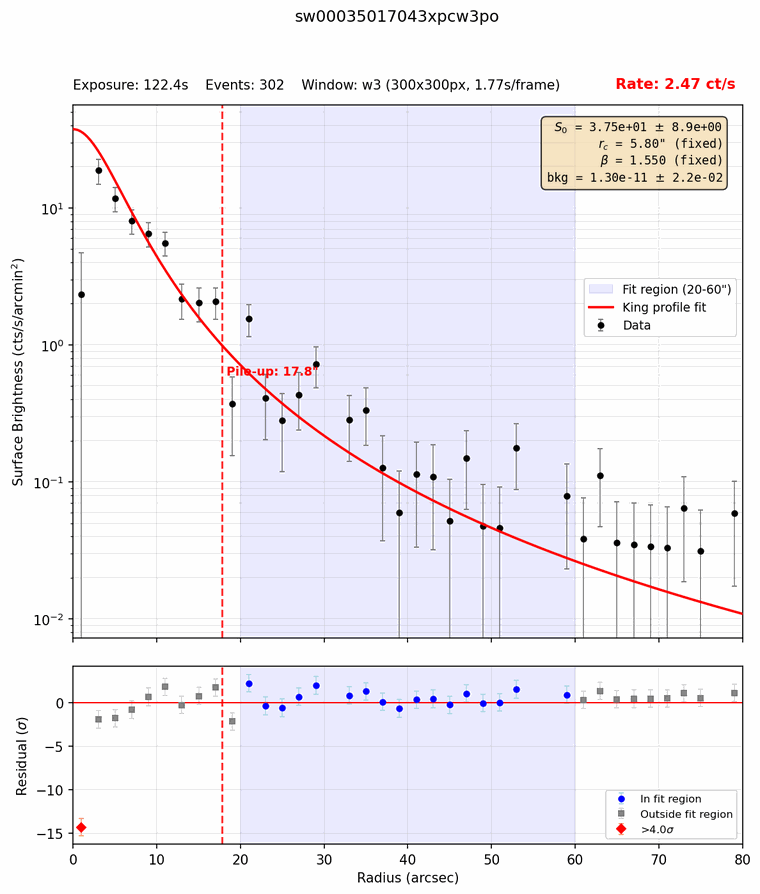

# Step 5 — PC-mode inspection

In PC (photon counting) mode the XRT images the whole field, reading the CCD
out every 1.77 s (in the `w3` window used for 3C 273). When a source is
bright, two or more photons often land on the same few pixels within one
frame. The CCD then records them as a single event with their summed energy,
or rejects it. This is **pile-up**: it removes counts from the core of the
source and hardens its spectrum, so the core has to be excluded from the
spectrum.

This step has three parts:

- **5a** `swift_xrt_king_profile.py` measures, for every PC observation, how
  much of the core to exclude (the pile-up radius).
- **5b** `swift_pc_source_viewer.py` draws a zoomed image of each source so
  you can check it by eye.
- **5c** a shell command makes the PC master table, which decides what
  [Step 7](07-extract.md) extracts.

Run them from inside `XRT_output`, in either terminal. They take seconds.

## What runs

### 5a — Pile-up radius

For each PC cleaned event file in each OBSID folder, the script:

1. **Finds the source.** It starts at `--ra`/`--dec` and moves to the mean
   position of the events within 15″, repeating with a shrinking circle.
2. **Builds a radial profile**: surface brightness in 2″ rings out to 80″, in
   ct/s/arcmin².
3. **Fits the PSF to the wings.** The King model of the XRT point-spread
   function, S(r) = S0 (1 + (r/rc)²)^−β + bkg, is fit between 20″ and 60″,
   where pile-up doesn't reach. The shape is fixed at the Swift calibration
   values (rc = 5.8″, β = 1.55); only the normalization S0 and the background
   are free.
4. **Finds where the data leave the model.** Walking inward from 30″, the
   radius is the outer edge of the first ring that differs from the model by
   4σ, or of the outer of two neighbouring rings that differ by 3σ.
5. **Checks for low counts.** In a short exposure the residuals can't reach
   3σ, so the measured radius comes out far too small. When S0 is uncertain by
   more than 10%, the script instead uses the radius where the fitted model
   falls to 1.75 counts per frame per arcmin², if that is larger. That
   threshold was calibrated on the long 3C 273 exposures.
6. **Applies overrides.** A radius you set in `pileup_overrides.txt` (in the
   working folder) replaces the automatic one.

| Flag | Purpose |
| ---- | ------- |
| `--ra` / `--dec` | Source position, J2000 decimal degrees (required) |
| `--rmin` / `--rmax` | Radii of the wing fit, in arcsec (default 20 and 60) |
| `--rbin` | Ring width in arcsec (default 2) |
| `--maxplot` | Largest radius plotted (default `--rmax` + 20) |
| `--centroid` | Search radius for the source position, in arcsec (default 15) |
| `--rc` / `--beta` | PSF shape, fixed (default 5.8″ and 1.55) |
| `--sigma` / `--sigma2` | Thresholds for two neighbouring rings / one ring (default 3 and 4) |
| `--sbthresh` | Low-count threshold in counts/frame/arcmin² (default 1.75) |
| `--maxs0err` | Largest S0 error for trusting the measured radius (default 0.10) |
| `--pdf` | Name of the collected plots (default `king_profiles.pdf`) |

### 5b — Source images

For each PC file with a `_pileup.txt`, the viewer draws a 100-pixel (about
4′) square around the source, with the source position (magenta, 8″ circle),
the pile-up radius (red dashed) and any override (purple dashed).

| Flag | Purpose |
| ---- | ------- |
| `--dimension` | Image size, e.g. `100px` (default) or `120arcsec` |
| `--radius` | Radius of the magenta circle, in arcsec (default 8) |
| `--pdf` | Name of the collected images (default `source_images.pdf`) |
| `--sosta` | Also mark `xrtcentroid` positions read from `source_extraction_<OBSID>.txt` files. Nothing in this pipeline writes those files |

### 5c — PC master table

A shell command (see [Common variants](#common-variants)) lists every pointed
PC event file in `pc_master_table.txt`, one row per file:

```
OBSID          filename                            include    badstripe  comment
00035017018    sw00035017018xpcw3po                yes        no         ""
00035017043    sw00035017043xpcw3po                yes        no         ""
```

Step 7 extracts only the rows with `include` = `yes`. `badstripe` and
`comment` are notes for you; nothing downstream acts on them. You edit the
table in [Step 6](06-wt-inspection.md), together with the WT table.

## How it works

### Reading a profile plot


The top panel shows the data (black) and the King model fitted to the shaded
20–60″ wings (red), extended inward. The bottom panel shows the difference in
σ. Orange and red diamonds are the 3σ and 4σ rings, and the dashed line is the
chosen radius.

Pile-up is the deficit in the core: here the data fall below the model inside
about 8″, by up to 43σ. The radius, though, comes from the outermost flagged ring,
and rings count whichever way they differ. In 018 an *excess* at 13–19″ sets
the radius to 20″; in 073 one at 23″ sets 24″. So the radius errs on the large
side: you lose some source counts, but no piled-up ones.

### The low-count guard



With 302 events, 043's profile is noisy. Only the innermost ring is flagged,
which would exclude just 2″. Its S0 is uncertain by 24%, so the script uses
the PSF threshold radius instead:

```
  Processing: sw00035017043xpcw3po_cl.evt
    ...
    Pile-up detected: recommended inner radius = 2.0"
    Window: w3 (300x300px, 1.77s/frame)
    S0 error: 24%   PSF-threshold radius: 17.8"
    LOW COUNTS: profile too poorly constrained (S0 error 24% > 10%); using PSF-threshold radius 17.8" instead of 2.0"
```

The five PC observations in the test set:

| OBSID | Exposure | S0 error | Measured | PSF threshold | Used |
| ----- | -------- | -------- | -------- | ------------- | ---- |
| 018 | 2545 s | 4% | 20.0″ | 20.2″ | 20.0″ |
| 043 | 122 s | 24% | 2.0″ | 17.8″ | **17.8″** (guard) |
| 073 | 6303 s | 3% | 24.0″ | 20.4″ | 24.0″ |
| 080 | 75 s | 36% | 4.0″ | 17.2″ | **17.2″** (guard) |
| 00091742013 | 1099 s | 6% | 10.0″ | 20.8″ | 10.0″ |

The last row is the SDSS J122933+015810 pointing from Step 4, with 3C 273
7.3′ off-axis. Its profile is clean, with the deficit starting at 10″. The PSF
threshold assumes the on-axis PSF shape and doesn't apply here; it replaces
the measured radius only for low-count data.

With proper exclusion, 043 and 080 keep too few counts to fit, so they drop
out of the light curve in Step 8. With their old 2–4″ radii they produced PC
fluxes up to 2.4 times too low.

### What `_pileup.txt` records

```
# Pile-up analysis for sw00035017043xpcw3po
# Source position (input): RA=187.277900 Dec=2.052400
# Centroid position (pix): X=442.06 Y=512.01
# Plate scale: 2.3573 arcsec/pixel
# Sigma thresholds: 3.0 (2 consec), 4.0 (single)
# King PSF: rc=5.80" beta=1.550 (fixed)
# Window: Window: w3 (300x300px, 1.77s/frame)
# Count rate: 2.468 ct/s
pileup_radius_arcsec = 17.8

# How pileup_radius_arcsec was chosen:
pileup_method = psf-threshold (low counts)
measured_pileup_radius_arcsec = 2.0
psf_threshold_radius_arcsec = 17.8
s0_fractional_error = 0.236
```

Step 7 reads the centroid, plate scale, count rate, `pileup_radius_arcsec` and
`override_radius_arcsec` (present when an override applies). It extracts an
annulus from the pile-up radius outward, centred on the centroid. The last
four lines are a record of how the radius was chosen.

### What to look for in the images


- **One point source at the magenta mark.** If the mark sits off the source,
  `--ra`/`--dec` or the centroid search went wrong.
- **A dark vertical line through or next to the source.** These are the XRT's
  bad columns. The exposure map, which the ARF uses in Step 7, corrects the
  flux for them, but they are worth a note in the `comment` column.
- **A second source within about 1′**, which would contaminate the spectrum.
- **A doubled or smeared source**, a sign of pointing problems. Exclude it.

## Inputs and outputs

**Inputs:** the `XRT_output` folder from Step 3 (its PC cleaned event files),
your source position, and optionally `pileup_overrides.txt`.

**Outputs:**

```
XRT_output/
├── king_profiles.pdf                      all profile plots (5a)
├── source_images.pdf                      all source images (5b)
├── pc_master_table.txt                    the PC master table (5c)
├── pileup_overrides.txt                   only if you made one
└── 00035017018/
    ├── sw00035017018xpcw3po_king_profile.png
    ├── sw00035017018xpcw3po_pileup.txt    ← read by 5b and Step 7
    └── sw00035017018xpcw3po_source.png
```

## Common variants

```bash
cd XRT_output

# 5a and 5b
swift_xrt_king_profile.py --ra 187.2779 --dec 2.0524
swift_pc_source_viewer.py

# 5c: the PC master table
find . -name '*xpc*po*_cl.evt' | sort | \
  awk -F'/' '{obsid=$2; file=$NF; gsub(/^\.\//, "", obsid); \
  sub(/_cl\.evt$/, "", file); \
  printf "%-14s %-35s %-10s %-10s \"%s\"\n", obsid, file, "yes", "no", ""}' | \
  (printf "%-14s %-35s %-10s %-10s %s\n" "OBSID" "filename" "include" "badstripe" "comment"; cat) \
  > pc_master_table.txt

# Set your own radius for one file, then re-run 5a so it takes effect
echo "sw00035017073xpcw3po 20.0" >> pileup_overrides.txt
swift_xrt_king_profile.py --ra 187.2779 --dec 2.0524

# Larger source images
swift_pc_source_viewer.py --dimension 120arcsec
```

`pileup_overrides.txt` holds one file stem and radius in arcsec per line;
lines starting with `#` are ignored.

## Gotchas

1. **An override takes effect only after you re-run 5a.** Step 7 reads the
   radius from `_pileup.txt`, not from `pileup_overrides.txt`. After editing
   the overrides, run `swift_xrt_king_profile.py` again; the plots then show
   your radius as a purple dashed line. Overrides are keyed by the file stem
   (`sw00035017073xpcw3po`), not the OBSID.

2. **Re-running 5c overwrites the table.** The command writes
   `pc_master_table.txt` from scratch, so your `include` and `comment` edits
   are lost. Make it once, then edit it.

3. **Below 0.5 ct/s nothing is excluded.** Step 7 skips the pile-up exclusion,
   override included, when a file's count rate is under 0.5 ct/s. That rate is
   for the whole field (Step 4, gotcha 3), so it is only a rough guide for a
   faint source in a bright field.

4. **The table includes pointings of other targets.** Every pointed PC file
   gets a row with `include` = `yes`, including the SDSS J122933 pointing
   above. Set `include` to `no` for any you don't want.

5. **`badstripe` does nothing.** It is a note only. To drop an observation,
   set `include` to `no`.

## Notes

<!-- Eileen: drop observations here as you walk through. Format suggestion:
     - 2026-MM-DD — observation / gotcha / "I ran this on X and Y happened"
-->

_(no notes yet)_
