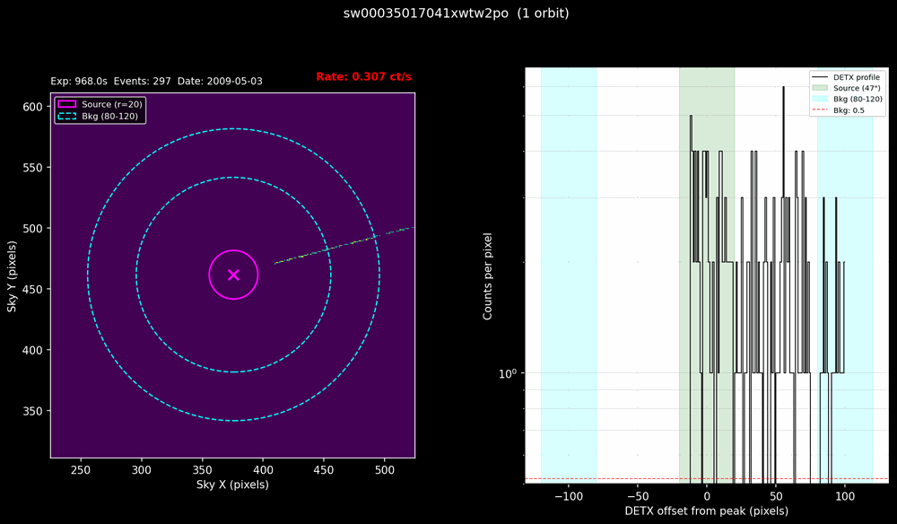
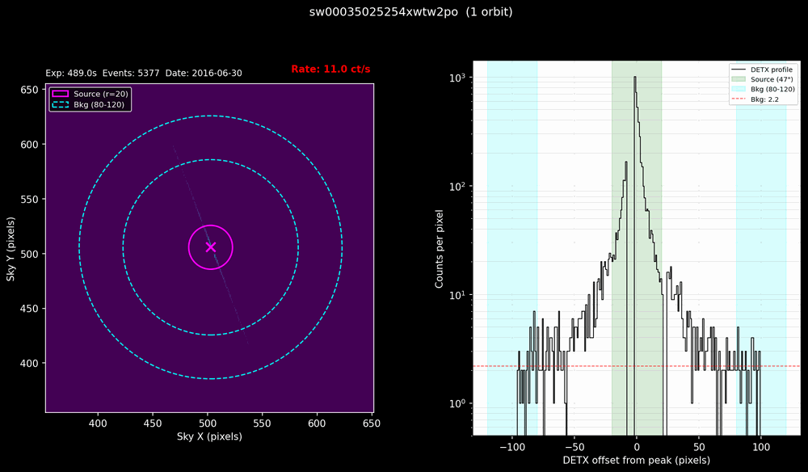

# Step 6 — WT-mode inspection

In WT (windowed timing) mode the XRT reads out a strip of the CCD 200 columns
(about 8′) wide and collapses the other direction. Each event gets a position
along the strip (DETX) but none across it. The readout is fast, so WT handles
bright sources like 3C 273 without pile-up (that starts around 100–150 ct/s).

This step has three parts:

- **6a** `swift_wt_summary_viewer.py` finds the source in each WT
  observation, checks that it is actually in the strip, plots it, and records
  the extraction regions in `_wt_profile.txt`.
- **6b** `make_wt_master_table.py` lists the WT observations in
  `wt_master_table.txt`, excluding the ones that can't be used.
- **6c** you edit both master tables, the PC one from
  [Step 5](05-pc-inspection.md) and the WT one. This is the last manual
  decision before [Step 7](07-extract.md) extracts spectra.

Run them from inside `XRT_output`, in either terminal. They take seconds.

## What runs

### 6a — WT viewer

For each pointed WT event file (settling and slew segments are skipped), the
viewer:

1. **Skips** files under 20 s of exposure or with fewer than 10 events.
2. **Finds the source.** It converts `--ra`/`--dec` to sky pixels with the
   event file's sky projection, then moves to the mean position of the events
   within 15 pixels (three passes).
3. **Sets the regions**: a 20-pixel (47″) source circle and an 80–120 pixel
   background annulus. In 1D data only the length along the strip matters.
   The source circle covers 40 pixels of it. The strip is 200 pixels wide, so
   the annulus meets it 80–100 pixels out on each side of a centred source:
   40 pixels in all, and still 40 if the source sits up to 20 pixels off
   centre. One pixel comes off the background for the bad column at the
   strip's edge, so the BACKSCAL values are 40 and 39. Step 7 writes them into
   the spectra.
4. **Tests whether the source is there.** It compares the counts in the
   source circle with the background counts scaled by 40/39. Below 3σ
   (`--detsigma`) the source counts as not detected, which almost always means
   the target was outside the strip.
5. **Writes** `_wt_profile.txt` (position, regions, BACKSCAL, detection) and a
   plot of the sky image and DETX profile. Observations with several orbits
   also get per-orbit sky images.

| Flag | Purpose |
| ---- | ------- |
| `--ra` / `--dec` | Source position, J2000 decimal degrees (required); use the same as in Step 3 |
| `--srcrad` | Source circle radius in pixels (default 20) |
| `--bkginner` / `--bkgouter` | Background annulus radii in pixels (default 80 and 120) |
| `--detsigma` | Detection threshold in σ (default 3) |
| `--expgt` | Shortest exposure to process, in s (default 20) |
| `--compact` | Print the summary table only, no plots |
| `--nmax` | Process only the first N observations |
| `--pdf` | Name of the collected plots (default `wt_profiles.pdf`) |

### 6b — WT master table

`make_wt_master_table.py` lists every pointed WT file. It sets `include` to
`no` for exposures under 20 s (`--expmin`) and for sources the viewer did not
detect, with the reason in the comment. For the Step 3 test set:

```
OBSID          filename                            include      exp(s)     ct/s  n_gti comment
00035017018    sw00035017018xwtw2po                no             11.6     4.84      1 "exposure < 20 s"
00035017029    sw00035017029xwtw2po                yes          1342.4     4.57      1 ""
00035017037    sw00035017037xwtw2po                yes           960.6     4.24      2 ""
00035017041    sw00035017041xwtw2po                no            968.0     0.31      1 "source not detected (-8.5 sigma); likely outside WT window"
00035017043    sw00035017043xwtw2po                no              8.4     4.06      1 "exposure < 20 s"
00035017080    sw00035017080xwtw2po                yes           972.4     4.50      1 ""
```

### 6c — Edit the master tables

Open `pc_master_table.txt` and `wt_master_table.txt` in a text editor. Set
`include` to `no` for any observation you don't want, and say why in the
comment. Step 7 extracts only the `yes` rows. Things worth excluding or noting
are under [What to look for](#what-to-look-for) here and in
[Step 5](05-pc-inspection.md#what-to-look-for-in-the-images).

## How it works

### Reading a WT plot


On the left, the sky image: the strip is the line through the source, laid
on the sky at the observation's roll angle, with the source circle (magenta)
and background annulus (cyan). On the right, the DETX profile: counts per
column along the strip, centred on the peak, with the source region (green),
the background regions (cyan) and the background level (red dashed).

The viewer prints what it found:

```
  [2/6] 00035017029 / sw00035017029xwtw2po
    Exposure: 1342.4s  Events: 6141  Rate: 4.57 ct/s  Date: 2009-02-09T16:52:51.079
    Source (sky): X=549.8, Y=562.3
    Source counts (r=20): 5602
    Bkg counts (80-120): 79
    Detection: 73.2 sigma
```

### When the target isn't in the strip



OBSID 041 was pointed 5.1′ from 3C 273 (the [Step 4](04-survey.md) survey
shows the offset). The strip ends short of the target, so the source circle
sits beyond the strip's end, and the DETX profile is flat:

```
  [4/6] 00035017041 / sw00035017041xwtw2po
    Exposure: 968.0s  Events: 297  Rate: 0.31 ct/s  Date: 2009-05-03T21:45:57.980
    Source (sky): X=375.7, Y=461.5
    Source counts (r=20): 0
    Bkg counts (80-120): 72
    WARNING: source NOT detected (-8.5 sigma < 3.0). The target is probably outside the WT window; make_wt_master_table.py will set include=no.
```

The faintest real 3C 273 WT observation in epoch 1 is detected at 39σ, so the
3σ threshold leaves a wide margin.

### Bad columns



The XRT CCD has bad columns, which record nothing. In WT mode a bad column
removes a whole column of the strip, so it shows as a drop to zero in the DETX
profile. Above, in an observation of the blazar 1ES 1959+650, one sits right
beside the peak and another about 22 columns out.

Step 7's ARF uses the exposure map to correct the flux for the counts lost
there. Here it lowers the effective area by 23%, matching the 24% of the
source's exposure that the bad column removes. A correction that size is
worth a note in the comment column.

### What `_wt_profile.txt` records

```
# WT profile analysis for sw00035017029xwtw2po
# Regions in sky coordinates (pixels)
# Date: 2009-02-09T16:52:51.079
# Exposure: 1342.4 s
# Events: 6141
# Count rate: 4.575 ct/s
# Plate scale: 2.3573 arcsec/pixel

source_x = 549.82
source_y = 562.32
source_radius_pix = 20
source_radius_arcsec = 47.1
bkg_inner_pix = 80
bkg_outer_pix = 120

# BACKSCAL values for WT mode (1D extent):
# swift_xrt_extract_spectra.py writes these into
# the spectra in place of XSELECT's 2D values.
backscal_src = 40
backscal_bkg = 39

# Source detection (read by make_wt_master_table.py):
src_counts = 5602
bkg_counts = 79
detection_sigma = 73.2
source_detected = yes
```

Step 7 reads the position, the radii and the plate scale, and computes the
same BACKSCAL values from the radii. The table in 6b reads
`source_detected` and `detection_sigma`.

### What to look for

- **A sharp DETX peak inside the green band.** A flat profile means the
  target wasn't in the strip; 6b excludes those automatically.
- **Drops to zero near the peak**: bad columns, as above.
- **A second peak in the profile**, from another source on the strip, which
  would add to the source or background counts.
- **Multi-orbit observations**: the per-orbit sky images in
  `wt_profiles.pdf` should show the source in the same place each orbit.

## Inputs and outputs

**Inputs:** the `XRT_output` folder from Step 3 (its pointed WT cleaned event
files) and your source position.

**Outputs:**

```
XRT_output/
├── wt_profiles.pdf                       all WT plots (6a)
├── wt_master_table.txt                   the WT master table (6b)
└── 00035017029/
    ├── sw00035017029xwtw2po_wt_combined.png
    └── sw00035017029xwtw2po_wt_profile.txt   ← read by 6b and Step 7
```

## Common variants

```bash
cd XRT_output

# 6a and 6b
swift_wt_summary_viewer.py --ra 187.2779 --dec 2.0524
make_wt_master_table.py

# Summary table only, no plots
swift_wt_summary_viewer.py --ra 187.2779 --dec 2.0524 --compact

# Remake the WT table without losing your edits, then compare
make_wt_master_table.py --output wt_master_table_new.txt
diff wt_master_table.txt wt_master_table_new.txt
```

## Gotchas

1. **Re-running 6b overwrites the table.** `make_wt_master_table.py` writes
   `wt_master_table.txt` from scratch, so your edits are lost. Write to a new
   file with `--output` and compare, as above.

2. **Use the same `--ra`/`--dec` as in Step 3.** WT events carry no position
   across the strip; xrtpipeline placed them using the Step 3 position, so the
   viewer has to look there.

3. **Run the viewer before 6b and Step 7.** Without a `_wt_profile.txt`, 6b
   can't test the detection (it warns), and Step 7 falls back to the median
   position of all events in the file, which is crude.

4. **Exposures under 20 s are left out**: the viewer skips them and 6b
   excludes them. Some observations start with a few seconds of WT before
   switching to PC (018 above).

5. **If you ran Steps 5–6 before October 2026 on a source far from the
   celestial equator, re-run them.** Until then both steps converted RA/Dec
   to pixels without the cos(Dec) factor. That made no difference for 3C 273
   at Dec +2°. At Dec +65° it put the WT position 146 pixels off a 10.8 ct/s
   source, which was then excluded as "not detected". At Dec +71° the PC
   pile-up profiles were built on empty sky.

## Notes

<!-- Eileen: drop observations here as you walk through. Format suggestion:
     - 2026-MM-DD — observation / gotcha / "I ran this on X and Y happened"
-->

_(no notes yet)_
